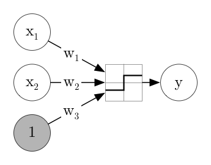

 

Part 2: The Perceptron
==================

The perceptron is the simplest instance of a neural network. In order to understand it, we need some very basic mathematical concepts, which we'll just take for granted.

Before we look at the model, we agree on some language.

## Machine Learning Vocab

In ML, we train a _model_ using _training data_ and certain _algorithms_. If the data we provide are labelled and it tries to learn the correct labels, it is typically _supervised_ learning, if it tries to learn patterns from the data without prescribed labels, that would be _unsupervised_ learning.

*Examples*:

- image recognition is typically supervised learning —- the images have to be pre-labelled ("this is a dog")
- you have a collection of voice samples from different people (several each) and want to cluster the samples created by the same person. Since you don't have labels, this has to happen unsupervised

If you want the machine to give labels to its inputs, you build a _classifier_, if you want to compute numerical values, this is a _regression_.

*Examples*:

- deciding which letter was written as the input in character recognition is a classification problem
- giving an estimate for sales projections from certain input parameters is a regression task

## The Perceptron

For the first step into ML, let's start with a very basic task to learn: the *OR*-gate.

The outline of our machine is going to look like this: 

An OR-gate is a very basic part of electronics. It has two inputs, and either can be on or off. The OR-gate itself then will be on if any (or either) of the inputs is on and will be off when both inputs are off.

The weights is what the machine learns, the block represents an activation function.

Instead of using "on" and "off", it's easier to work with numbers. We call then:

$$x_1$$: input one, can be $$0$$ or $$1$$.

$$x_2$$: input two, can be $$0$$ or $$1$$.

$$y$$: output, can be $$0$$ or $$1$$.

What we want to model is

$$y = x_1 \lor x_2$$, that is to say $$y=1$$ if $$x_1=1$$ or $$x_2=1$$, and $$y=0$$ if $$x_1=x_2=0$$.

**I'll show it live!**

Now for you: try it with the *AND*-gate.

The AND gate ($$x_1 \land x_2$$) is only on if _both_ inputs are on.

But we didn't really learn!

Well... if we started out with random weights and just compared the results to the desired outputs, we could update the weights in order to improve the predictions!

**Let's try it live!**

We're trying to minimize our loss function, so we want in each iteration change the weights such that loss decreases. This reminds us of _derivatives_?

In several dimensions, the derivative is called gradient, and it is a vector that points towards the steepest change in the function. If we compute the derivative of the loss with respect to all weights, wen can just compute the derivative at every step and change all weights in the direction the gradient tells us.

## Quick Python Intro!

## Our First neural net!