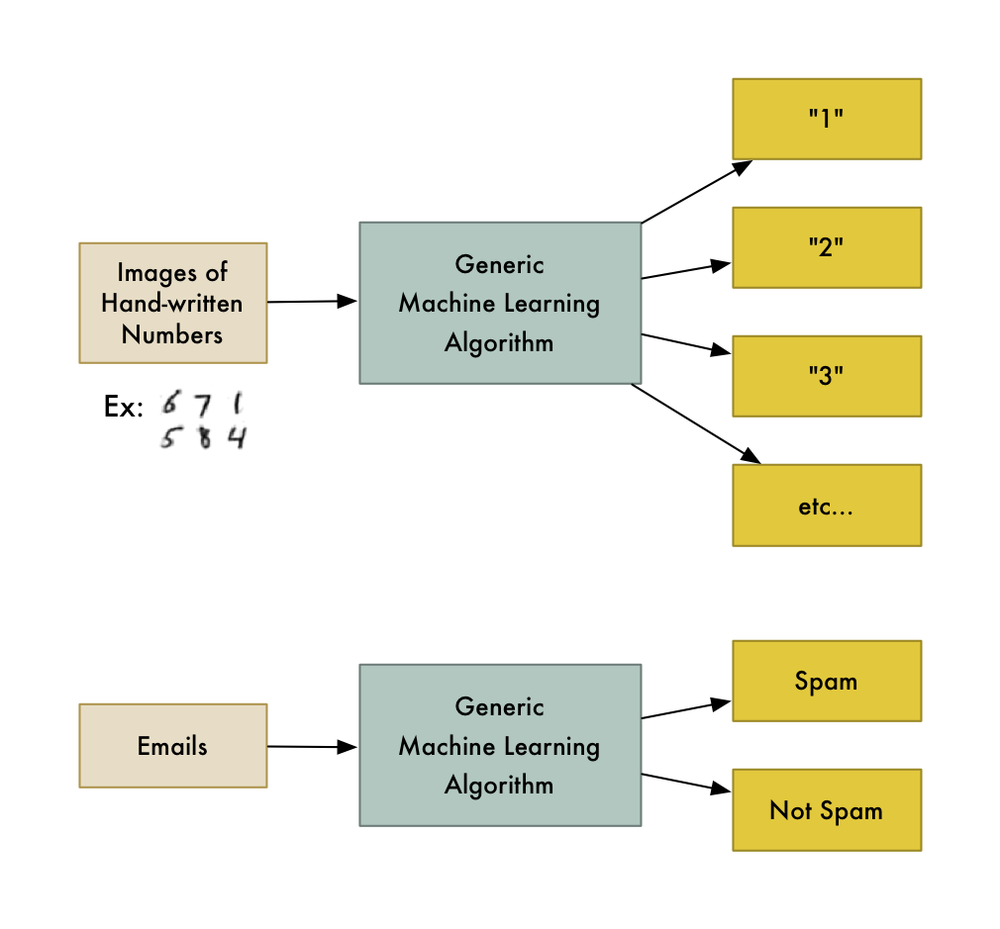

Part 2: The Perceptron
==================

The perceptron is the simplest instance of a neural network. In order to understand it, we need some very basic mathematical conceptst, which we'll just take for granted.

Before we look at the model, we agree on some language.

## Machine Learning Vocab

In ML, we train a _model_ using _training data_ and certain _algorithms_. If the data we provide are labelled and it tries to learn the correct labels, it is typically _supervised_ learning, if it tries to learn patterns from the data without prescribed labels, that would be _unsupervised_ learning.

*Examples*:

- image recognition is typically supervised learning —- the images have to be pre-labelled ("this is a dog")
- you have a collection of voice samples from different people (several each) and want to cluster the samples created by the same person. Since you don't have labels, this has to happen unsupervised

If you want the machine to give labels to its inputs, you build a _classifier_, if you want to compute numerical values, this is a _regression_.

*Examples*:

- deciding which letter was written as the input in character recognition is a classification problem
- giving an estimate for sales projections from certain input parameters is a regression task